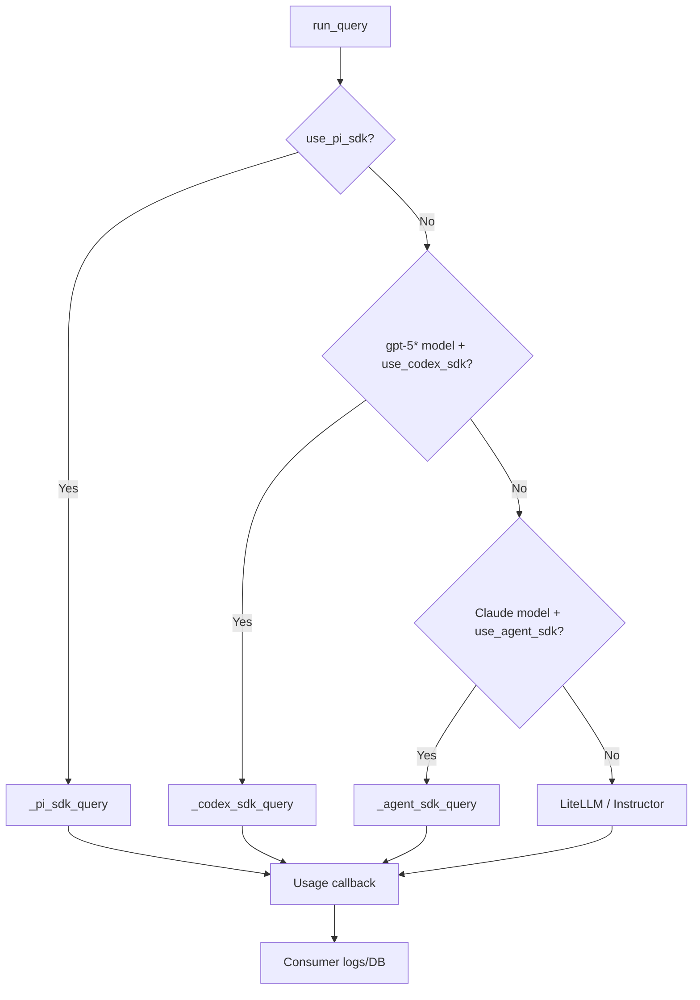

# llm-query-utils — Architecture

## Purpose

Reusable LLM query layer extracted from [llmpedia-workflows](https://github.com/manolorueda/llmpedia-workflows). Provides a single `run_query()` function that transparently routes queries to the appropriate backend based on the model requested.

**Target users:** Internal projects that need LLM calls with structured output, retries, caching, and usage tracking without duplicating plumbing.

## Tech Stack

| Layer | Choice | Why |
|-------|--------|-----|
| Query routing | `run_query()` | Single entrypoint, auto-selects backend |
| Pi backend | Pi CLI (`pi --mode json`) | Local Pi auth/config path from Python without a Node bridge |
| Codex backend | Codex CLI (`codex exec`) | ChatGPT subscription auth path without API keys |
| Claude backend | `claude-agent-sdk` | Native structured output, tool use |
| Other models | `litellm>=1.81.11` + `instructor` | OpenAI-compatible and `chatgpt/...` subscription access, structured output via tool-calling |
| Schemas | `pydantic` v2 | Shared structured-output validation across backends |
| Cost tracking | `litellm` pricing utilities | Per-call token/cost calculation |
| Packaging | `uv` + `uv_build` | Fast, lockfile-based |

## Architecture



### Routing rules

`run_query()` can route to four backends:
- Pi CLI when:
  - `use_pi_sdk=True`
  - single-turn `user_message` flow (no `messages`)
  - existing extended thinking options are not enabled; use `pi_options={"thinking": "high"}` instead
  - `sdk_allowed_tools` is not provided; use `pi_options={"tools": [...]}` instead
- Codex CLI when:
  - `use_codex_sdk=True`
  - `llm_model` basename starts with `gpt-5`, including provider-prefixed names like `chatgpt/gpt-5.4`
  - single-turn `user_message` flow (no `messages`)
  - extended thinking options are not enabled
- Agent SDK for Claude models (default), but falls back to LiteLLM when:
- Custom `messages` list is provided (multi-turn)
- Extended thinking is enabled
- Model name doesn't contain "claude"
- LiteLLM/Instructor for all remaining cases, including ChatGPT subscription models named `chatgpt/...` when `use_codex_sdk=False`

## Directory Layout

```
llm-query-utils/
├── pyproject.toml          # Package metadata, dependencies
├── features.yaml           # Backlog tracker
├── docs/
│   └── STRUCTURE.md        # This file
└── src/llm_query_utils/
    ├── __init__.py          # Public API exports
    ├── config.py            # DEFAULT_MODEL, FAST_MODEL constants
    ├── query.py             # run_query() + _pi_sdk_query() + _codex_sdk_query() + _agent_sdk_query()
    ├── cache.py             # add_cache_control() for Anthropic prompt caching
    ├── vision.py            # format_vision_messages() for multi-modal
    └── usage.py             # UsageData dataclass + callback mechanism
```

## Key Modules

### `query.py` — Core routing

- **`run_query()`**: Synchronous entrypoint. Routes to Pi CLI when `use_pi_sdk=True`, Codex CLI for `gpt-5*` models when `use_codex_sdk=True`, Agent SDK for Claude, or LiteLLM otherwise. Handles retries (0s, 30s, 60s, 120s), extended thinking setup, and temperature disabling for reasoning models (o1/o3/gpt-5).
- **`_pi_sdk_query()`**: Async Pi CLI transport wrapper using `pi --mode json`. Defaults to `--no-session`, `--no-tools`, and isolated resources. Supports plain output and prompt-instructed structured output validated by Pydantic, and maps Pi message usage into the usage callback.
- **`_codex_sdk_query()`**: Async Codex transport wrapper using `codex exec` + ChatGPT-auth preflight (`codex login status`). Supports plain and structured output (`--output-schema`), and usage callback mapping from JSON events.
- **`_agent_sdk_query()`**: Async Agent SDK handler. Streams messages, counts tool calls, extracts structured output via `output_format`.

### `usage.py` — Usage tracking

Consumer registers a callback via `set_usage_callback(fn)`. Query backends emit `UsageData` (tokens, costs, cache stats) through this callback, decoupling this package from any specific logging/DB implementation.

Usage emission notes:
- LiteLLM path emits usage from provider-reported token usage.
- Pi path emits usage from Pi assistant message usage payloads.
- Codex path emits usage from Codex event stream usage payloads.
- Agent SDK path emits one usage event when a terminal `ResultMessage` is received.
- If Agent SDK omits usage payload fields, Agent usage falls back to zeros instead of skipping the callback event.

### `cache.py` — Prompt caching

`add_cache_control()` injects `cache_control: {type: ephemeral}` into a message at a given index, enabling Anthropic's prompt caching. No-ops for non-Claude models.

### `vision.py` — Multi-modal formatting

`format_vision_messages()` orders image/text content blocks per provider convention (Claude: images first; others: text first).

## Design Patterns

- **No global state** beyond the optional usage callback.
- **No env loading** — consumers handle their own `.env`.
- **Pydantic for structured output** across backends (Instructor for LiteLLM, `output_format` schema for Agent SDK, native Codex schema, prompt-instructed Pi JSON validation).
- **Errors surface naturally** — no blanket try/except. Retries only on transient API failures.

## How to Install (dev)

```bash
cd llm-query-utils
uv sync
```

To use from another project:

```bash
uv add llm-query-utils --git https://github.com/manolorueda/llm-query-utils.git
```
