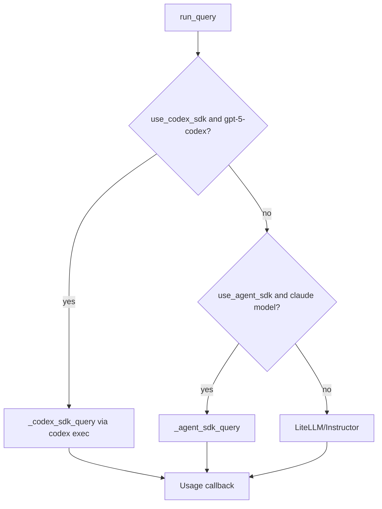

**Feature:** codex-001 -> Codex CLI integration for ChatGPT-subscription-authenticated queries.

## Summary

Implemented a third backend route in `run_query()` for Codex (`gpt-5-codex`) using local Codex CLI authentication (`codex login`) instead of API keys.

## Final Architecture

## Decisions

- Chosen transport: Codex CLI (`codex exec --json --output-last-message`) from Python.
- Auth contract: preflight requires `codex login status` to show `Logged in using ChatGPT`.
- Codex route is explicit opt-in (`use_codex_sdk=False` by default).
- Initial Codex allowlist: `gpt-5-codex`.
- Structured output: JSON schema path through `--output-schema` + `pydantic` validation.

## Completed Work

- [x] Added Codex model detection and routing gate in `run_query()`.
- [x] Added `_codex_sdk_query()` execution path.
- [x] Added auth preflight and actionable auth/CLI-not-found errors.
- [x] Added Codex JSONL usage parsing and callback mapping.
- [x] Added structured output validation for Codex responses.
- [x] Updated `README.md` with Codex route usage and auth prerequisites.
- [x] Updated `docs/STRUCTURE.md` to reflect 3-route architecture.
- [x] Added tests for routing, Codex structured output, and usage callback behavior.

## Verification

- Local import smoke: passed.
- Live Codex smoke via `run_query(... use_codex_sdk=True ...)`: passed.
- Test suite: `uv run --with pytest pytest -q` -> `8 passed`.

## Known Follow-up

- `codex-001.1` (pending): handle `tokencost` missing pricing for `gpt-5-codex` when requests route through LiteLLM.
